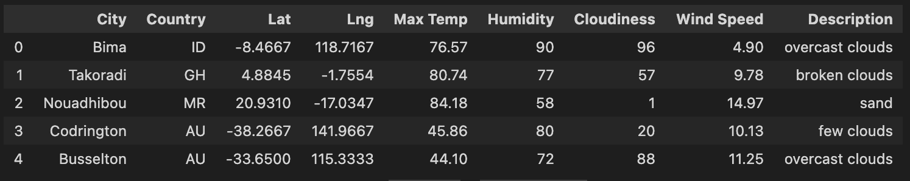

# World_Weather_Analysis

## Overview of WeatherPy Analysis

Our client, Jack, loves the PlanMyTrip app, but he wants to make a few changes to take the app even further. He wants to add the weather description to the weather data we already have, then have beta testers use input statements to filter the data for their weather preferences. These preferences will be used to find possible travel destinations and close hotels. From these possible locations, the tester will choose four cities to create an itinerary. Using the Google Maps Directions API, we will create a travel route between the four cities and make a marker layer map.

### Purpose

The purpose of this analysis is to make our PlanMyTrip app even better by adding a weather description, user input, and maps to make a travel itinerary.

## WeatherPy Analysis Results

### Weather Database

We first found weather data for random cities around the world using the OpenWeatherMap API and the citipy module. The image below shows the first five cities in the DataFrame.

### Vacation Search

We then narrowed down the weather DataFrame by using customer input. The customer will choose a maximum and minimum temperature to filter the list. We used the data from the narrowed down list with our Google API to create a map. The customer can click on a city on the map and our label shows a hotel name, the city, country, and current weather, as seen in the image below.

### Vacation Itinerary

Next, we created a travel itinerary that shows the route between four chosen cities, using Google Directions API. Lastly, we created a marker layer map for each of the four cities on the itinerary. The two images are shown below. 

## WeatherPy Analysis Summary

We made many changes to our PlanMyTrip app, and we can see the improvements. Our clients can now find cities based on a maximum and minimum temperature, and view those cities on a map with markers. They can also choose four cities and get directions between the cities. Overall, the changes have made our app even better.

